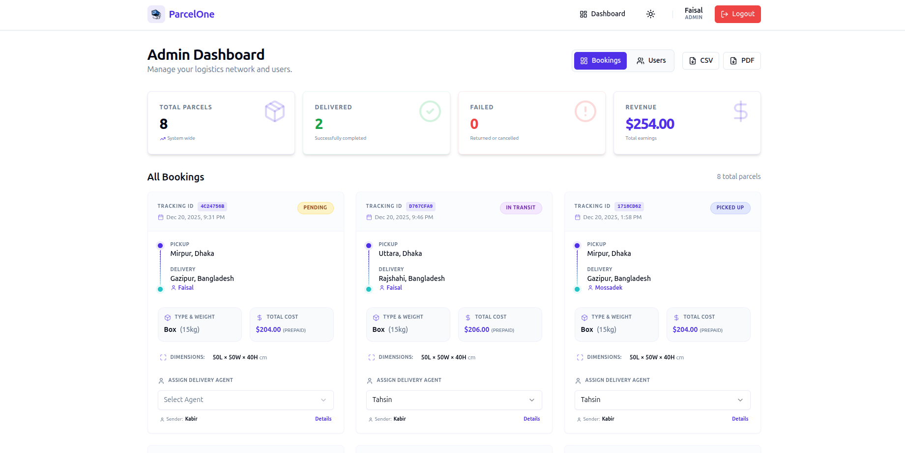
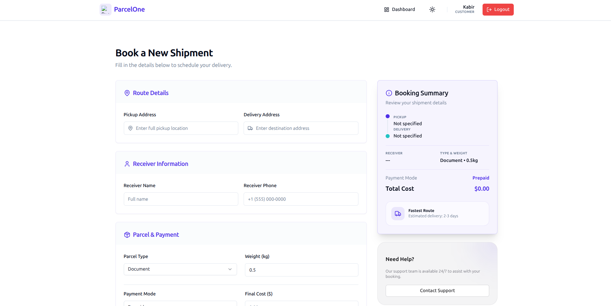

# ParcelOne

Real-time courier tracking and management — customers book parcels, delivery agents update them on the move, and admins run the operation, with live location updates streaming onto a map as they happen.

**[Live demo →](https://parcelone-frontend.vercel.app)** · Backend: [parcelone-backend](https://github.com/salsadsid/parcelone-backend)

## Screenshots

| Admin dashboard | Book a parcel |
|---|---|
|  |  |


## Why I built this

To work through the full shape of a logistics product on the frontend: three user roles with genuinely different workflows, real-time state that arrives over sockets rather than polling, and map-based UI — the kind of moving-parts app where cache consistency actually gets tested.

## Features

**Customers**
- Book parcels with pickup and delivery points selected on an interactive Google Map
- Track each parcel on a live map — the marker moves as the agent does
- Status timeline from booking to delivery

**Delivery agents**
- Agent dashboard with assigned parcels and status updates
- Location updates propagate to every viewer in real time

**Admins**
- Operations dashboard across all parcels, agents, and customers
- One-click PDF report export per view (jsPDF + autoTable, date-stamped files)

**Platform**
- Role-gated routing (`RequireAuth` / `GuestRoute`) with persisted sessions across reloads
- Light/dark theme, fully responsive layout
- Toast feedback for every mutation (Sonner)
- API health indicator in the footer

## How the live tracking works

The parcel details page opens a Socket.io connection and subscribes to `parcelLocationUpdated` events; incoming coordinates update the Google Map marker and the status timeline without a refetch. Server state everywhere else lives in RTK Query, so socket pushes and cached queries stay consistent instead of fighting each other.

## Tech stack

React (Vite) · Redux Toolkit + RTK Query · Socket.io client · @react-google-maps/api · Tailwind CSS + shadcn/ui (Radix) · Framer Motion · react-hook-form · jsPDF · Sonner

## Running locally

Requires Node.js 18+ and the [backend](https://github.com/salsadsid/parcelone-backend) running.

```bash
npm install
npm run dev
```

`.env`:

```env
VITE_GOOGLE_MAPS_API_KEY=your_google_maps_api_key
VITE_PRODUCTION_URL=http://localhost:5000/api
```

`npm run build` for a production build.

## Project structure

```
src/
  app/         store configuration
  components/  role dashboards, map, layout, guards, UI primitives
  features/    RTK Query API slices and auth state
  pages/       Home, Login/Register, Dashboard, BookParcel, ParcelDetails
  lib/         helpers
```
